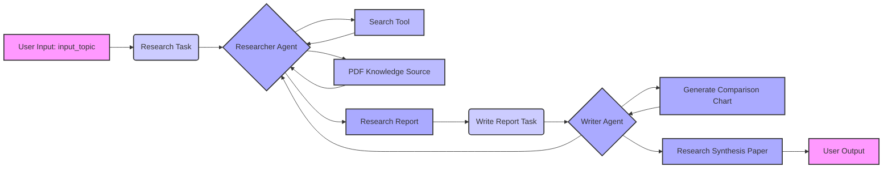

# crewai-AutoResearch-Synthesis
This is a project that automates the whole process of writing a research paper using AI. It handles everything from gathering research to putting together a complete report.
---

# Research Synthesis Automation with CrewAI

This project automates the process of research and report writing using the CrewAI framework. It leverages multiple autonomous agents to perform specific tasks, creating a structured and detailed research synthesis paper. The project demonstrates the power of multi-agent collaboration and the use of large language models (LLMs) for sophisticated automation.

## Project Overview

This project employs two primary agents: a **Researcher** and a **Writer**, each with clearly defined roles. The Researcher conducts in-depth research on a user-specified topic, utilizing both a search tool and provided PDF documents as knowledge sources. This agent gathers information and synthesizes it into a detailed report. The Writer agent then takes this report and crafts a well-structured research synthesis paper. The paper adheres to academic standards and includes necessary charts.

### Key Features:

*   **Multi-Agent Collaboration:** Leverages CrewAI to create a collaborative workflow where agents work together to complete a complex task.
*   **Automated Research:** The `Researcher` agent uses a search tool and PDF documents to gather the most accurate and up-to-date information.
*   **Structured Reports:** The `Writer` agent produces a Research Synthesis Paper with standard academic sections, ensuring a clear and professional presentation of the research.
*   **Customizable Agents:** Each agent is designed with a role, goal, and backstory that can be easily modified to suit various needs.
*   **Knowledge Integration:** Incorporates both online search results and PDF documents as a rich and diverse information base.
*   **Chart Generation:** The `Writer` agent is capable of generating informative charts and graphs to visually represent research findings.
*   **Clear Workflow:** Employs a sequential process in CrewAI to manage the flow between agents, ensuring each task is executed in the correct order.
*   **Gemini 2.0 Flash Integration:** Utilizes the `gemini/gemini-2.0-flash-exp` LLM via the Langchain and LiteLLM interface for efficient and high-quality text generation.

## Diagram

## Agents and Tasks

### Researcher Agent

*   **Role:** Researcher
*   **Goal:** To conduct in-depth research on a given topic and produce a comprehensive and accurate report.
*   **Backstory:** The researcher is a dedicated expert with extensive knowledge in their field. They are responsible for gathering and synthesizing the most accurate and up-to-date data, leveraging reliable sources like academic papers, articles, and trusted websites, as well as internal knowledge sources.
*   **Tools:**
    *   Search Tool: Utilizes a search tool to access online information.
*   **Task:**
    *   **Description:** Conduct thorough research on the provided `input_topic` by searching through trusted sources and internal knowledge base, then synthesize findings into a comprehensive report.
    *   **Expected Output:** A detailed research report including key findings, the latest trends, and potential gaps in existing knowledge, all grounded in reliable sources.

### Writer Agent

*   **Role:** Writer
*   **Goal:** To write a detailed and well-structured Research Synthesis Paper based on the research findings provided by the Researcher, ensuring clarity and readability for all audiences.
*   **Backstory:** The writer is a skilled professional at transforming complex research findings into clear, structured, and engaging reports. They organize the information into digestible sections, maintaining clarity and relevance, and make the report enjoyable to read. They adhere to standard research paper structures.
*   **Task:**
    *   **Description:** Write a comprehensive, structured Research Synthesis Paper on the given `input_topic` based on the findings from the Researcher. The paper must be clear, informative, and engaging.
    *   **Expected Output:** A well-organized Research Synthesis Paper that includes sections such as:
        *   Abstract: Summary of key findings, methodologies, and significance.
        *   Introduction: Background, research question, and paper objectives.
        *   Literature Review: Review of existing studies and key research.
        *   Methodology: Explanation of the research process.
        *   Synthesis of Findings: Integration of research results into major themes or categories.
        *   Discussion: Implications of findings, limitations, and suggestions for future research.
        *   Conclusion: Summary of key points and recommendations.
        *   References: A comprehensive list of cited sources.
    *   Chart Generation: The writer agent also generates a comparison chart of OpenAI's model vs Deepseek's R1 model.

### Crew Setup

*   **Agents:** The project instantiates a list of agents (`researcher`, `writer`).
*   **Tasks:** The project creates a list of tasks (`research_task`, `write_report_task`)
*   **Process:** `Process.sequential` ensures tasks are executed in a predefined order, first the research then the writing.
*   **Knowledge Sources:** The `pdf_source` is provided to ensure all agents have access to this knowledge.
*   **Embedder:** An embedder is defined for the knowledge source which uses a Google model to create the embedddings.
