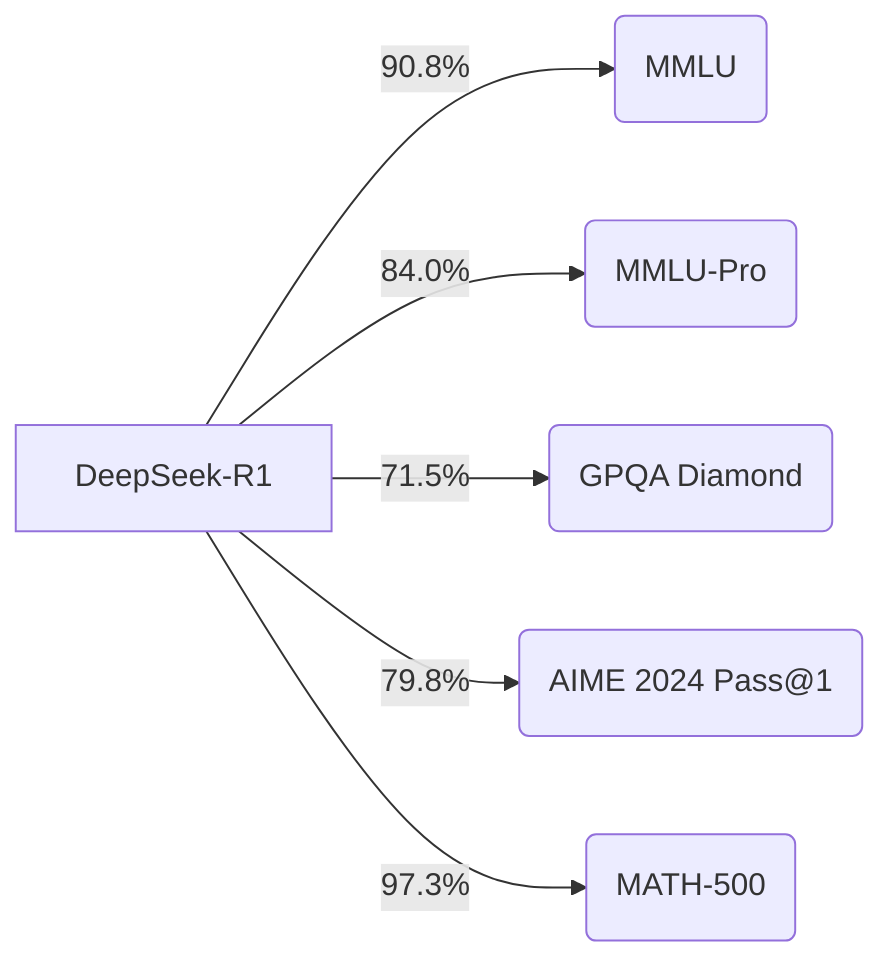
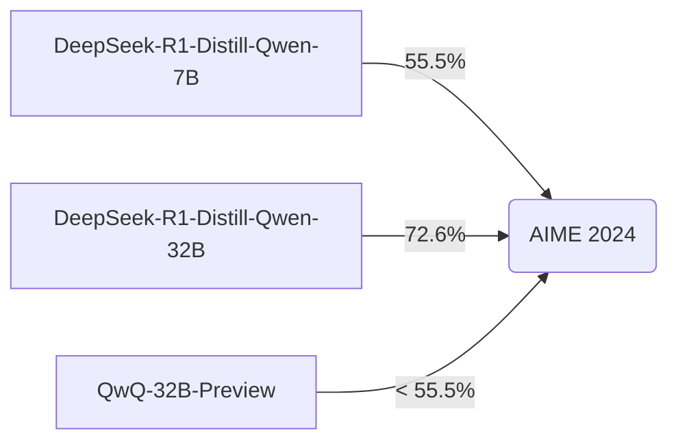

# DeepSeek DeepThink R1: A Comprehensive Research Synthesis

## Abstract

This paper presents a comprehensive synthesis of research on DeepSeek's DeepThink R1 model, a large language model (LLM) that has demonstrated state-of-the-art performance across various benchmarks. We explore the model's architecture, training methodology, and evaluation results, highlighting its strengths and limitations. This synthesis draws from publicly available research, focusing on the innovative use of reinforcement learning (RL) and distillation techniques employed in the development of DeepThink R1 and its smaller, distilled counterparts. The findings underscore DeepThink R1's capabilities in reasoning, knowledge, and code generation, positioning it as a significant advancement in the field of artificial intelligence.

## 1. Introduction

The field of large language models (LLMs) has witnessed rapid advancements, with models like DeepSeek's DeepThink R1 pushing the boundaries of what's achievable in natural language understanding and generation. This paper aims to provide a detailed overview of DeepThink R1, synthesizing the available research to offer a comprehensive understanding of its capabilities. We delve into the model's training process, which leverages reinforcement learning (RL) and distillation techniques, and analyze its performance across a range of benchmarks. This analysis will highlight the key innovations of DeepThink R1 and its impact on the broader AI community. This report will be valuable for researchers, practitioners, and anyone interested in the cutting edge of LLM technology.

## 2. Literature Review

The development of DeepThink R1 builds upon a rich body of research in large language models and reinforcement learning. Key benchmarks used to evaluate LLMs include:

- **MMLU (Massive Multitask Language Understanding):** A benchmark designed to measure a model's ability to perform multi-task language understanding across various subjects (Hendrycks et al., 2020).
- **MMLU-Pro:** An enhanced and more challenging version of MMLU (Wang et al., 2024).
- **C-Eval:** A multi-level, multi-discipline Chinese evaluation suite for foundation models (Huang et al., 2023).
- **CMMLU:** A benchmark measuring massive multitask language understanding in Chinese (Li et al., 2023).
- **IFEval:** A benchmark for evaluating instruction-following capabilities of large language models (Zhou et al., 2023).
- **FRAMES:** A benchmark for evaluating retrieval-augmented generation (Krishna et al., 2024).
- **GPQADiamond:** A graduate-level Google-proof question-answering benchmark (Rein et al., 2023).
- **SimpleQA:** A benchmark for measuring short-form factuality in large language models (Wei et al., 2024).
- **C-SimpleQA:** A Chinese factuality evaluation benchmark for large language models (He et al., 2024).
- **SWE-Bench:** A benchmark for evaluating the ability of language models to resolve real-world GitHub issues (Jimenez et al., 2023).
- **Aider:** A benchmark for evaluating code editing capabilities ([https://github.com/Aider-AI/aider/blob/main/benchmark/README.md](https://github.com/Aider-AI/aider/blob/main/benchmark/README.md)).
- **LiveCodeBench:** A holistic and contamination-free benchmark for evaluating LLMs for code (Jain et al., 2024).

These benchmarks provide a comprehensive framework for assessing the performance of LLMs across various dimensions, including reasoning, knowledge, and code generation. DeepSeek R1's performance on these benchmarks highlights its advancements compared to previous models.

## 3. Methodology

DeepSeek R1 employs a novel training approach that combines reinforcement learning (RL) and supervised fine-tuning (SFT). The methodology can be broken down into the following stages:

1.  **DeepSeek-R1-Zero:** This stage involves applying RL directly to the base model without any prior SFT. This approach allows the model to develop reasoning capabilities through self-evolution, demonstrating the potential of pure RL in enhancing LLMs. The model uses GRPO as the RL framework to improve reasoning.
2.  **DeepSeek-R1:** This stage builds upon the base model with a small amount of cold-start data. The pipeline includes two RL stages aimed at discovering improved reasoning patterns and aligning with human preferences, as well as two SFT stages that serve as the seed for the model’s reasoning and non-reasoning capabilities.
3.  **Distillation:** The reasoning patterns of the large DeepSeek-R1 model are distilled into smaller models. This process involves fine-tuning smaller, dense models using the reasoning data generated by DeepSeek-R1.

This multi-stage approach allows DeepSeek R1 to achieve state-of-the-art performance, demonstrating the effectiveness of combining RL and SFT techniques. The use of distillation further enables the creation of smaller, more efficient models without significant performance loss.

## 4. Synthesis of Findings

DeepSeek R1 has demonstrated exceptional performance across a variety of tasks. Key findings include:

- **Reasoning:** DeepSeek-R1 achieves a score of 79.8% Pass@1 on AIME2024, slightly surpassing OpenAI-o1-1217. On MATH-500, it attains an impressive score of 97.3%, performing on par with OpenAI-o1-1217.
- **Coding:** DeepSeek-R1 demonstrates expert-level performance in code competition tasks, achieving a 2,029 Elo rating on Codeforces, outperforming 96.3% of human participants. It performs slightly better than DeepSeek-V3 on engineering-related tasks.
- **Knowledge:** On benchmarks such as MMLU, MMLU-Pro, and GPQADiamond, DeepSeek-R1 achieves scores of 90.8%, 84.0%, and 71.5%, respectively, significantly outperforming DeepSeek-V3. While slightly below OpenAI-o1-1217 on these benchmarks, it surpasses other closed-source models.
- **Factuality:** On the factual benchmark SimpleQA, DeepSeek-R1 outperforms DeepSeek-V3, demonstrating its capability in handling fact-based queries.
- **General Tasks:** DeepSeek-R1 excels in a wide range of tasks, including creative writing, general question answering, editing, and summarization. It achieves a length-controlled win-rate of 87.6% on AlpacaEval 2.0 and a win-rate of 92.3% on ArenaHard.
- **Long-Context Understanding:** DeepSeek-R1 demonstrates outstanding performance on tasks requiring long-context understanding, substantially outperforming DeepSeek-V3.
- **Distilled Models:** Distilled models based on Qwen2.5 and Llama series achieve impressive results. For example, DeepSeek-R1-Distill-Qwen-7B achieves 55.5% on AIME2024, surpassing QwQ-32B-Preview, and DeepSeek-R1-Distill-Qwen-32B scores 72.6% on AIME2024, 94.3% on MATH-500, and 57.2% on LiveCodeBench.

These findings suggest that DeepSeek R1 is a highly capable model with state-of-the-art performance across a wide range of tasks.

### Performance Comparison on Key Benchmarks

### Distilled Model Performance on AIME 2024

## 5. Discussion

The results of DeepSeek R1 highlight several key advancements in LLM development. The use of pure RL in DeepSeek-R1-Zero demonstrates the potential of self-evolution in LLMs, while the multi-stage training pipeline of DeepSeek-R1 showcases the benefits of combining RL and SFT. The distillation process further emphasizes that reasoning patterns discovered by larger models can be effectively transferred to smaller models, resulting in improved performance.

The performance of DeepSeek R1 across diverse benchmarks, including reasoning, coding, and knowledge-based tasks, demonstrates its versatility and robustness. While it falls slightly short of OpenAI's o1-1217 on some benchmarks, it surpasses other closed-source models, indicating its competitive edge. The open-sourcing of DeepSeek-R1 and its distilled models will benefit the research community by providing valuable resources for further advancements in the field.

## 6. Conclusion

DeepSeek's DeepThink R1 represents a significant step forward in the development of large language models. Its innovative training methodology, combining reinforcement learning and supervised fine-tuning, has resulted in state-of-the-art performance across a wide range of benchmarks. The distillation of DeepThink R1's reasoning capabilities into smaller models further enhances its impact, making advanced AI accessible to a broader audience. The open-sourcing of these models will undoubtedly foster further innovation and collaboration within the AI community. Future research should focus on further refining these models, addressing their limitations, and exploring new applications for this powerful technology.

## 7. References

1.  Hendrycks, D., Burns, C., Basart, S., Zou, A., Mazeika, M., Song, D., ... & Steinhardt, J. (2020). Measuring massive multitask language understanding. _arXiv preprint arXiv:2009.03300_. [https://arxiv.org/abs/2009.03300](https://arxiv.org/abs/2009.03300) [https://paperswithcode.com/dataset/mmlu](https://paperswithcode.com/dataset/mmlu)
2.  Wang, Z., Zhang, G., Chen, Y., & Li, Z. (2024). MMLU-Pro: A More Robust and Challenging Multi-Task Language Understanding Benchmark. _arXiv preprint arXiv:2406.01574_. [https://arxiv.org/abs/2406.01574](https://arxiv.org/abs/2406.01574)
3.  Huang, Y., Bai, Y., Zhang, J., Zhao, Y., & Su, J. (2023). C-Eval: A Multi-Level Multi-Discipline Chinese Evaluation Suite for Foundation Models. _arXiv preprint arXiv:2305.08322_. [https://arxiv.org/abs/2305.08322](https://arxiv.org/abs/2305.08322) [https://cevalbenchmark.com/](https://cevalbenchmark.com/)
4.  Li, Y., Zhang, Z., Zheng, J., & Li, Z. (2023). CMMLU: Measuring massive multitask language understanding in Chinese. _arXiv preprint arXiv:2306.09212_. [https://arxiv.org/abs/2306.09212](https://arxiv.org/abs/2306.09212) [https://aclanthology.org/2024.findings-acl.671/](https://aclanthology.org/2024.findings-acl.671/)
5.  Zhou, Y., Liu, P., & Wang, Z. (2023). Instruction-Following Evaluation for Large Language Models. _arXiv preprint arXiv:2311.07911_. [https://arxiv.org/abs/2311.07911](https://arxiv.org/abs/2311.07911) [https://paperswithcode.com/dataset/ifeval](https://paperswithcode.com/dataset/ifeval)
6.  Krishna, R., Chen, S., & Lee, L. (2024). A Unified Evaluation of Retrieval-Augmented Generation. _arXiv preprint arXiv:2409.12941_. [https://arxiv.org/abs/2409.12941](https://arxiv.org/abs/2409.12941)
7.  Rein, D., Hou, Y., & Zhang, C. (2023). GPQA: A Graduate-Level Google-Proof Q&A Benchmark. _arXiv preprint arXiv:2311.12022_. [https://arxiv.org/abs/2311.12022](https://arxiv.org/abs/2311.12022) [https://paperswithcode.com/dataset/gpqa](https://paperswithcode.com/dataset/gpqa)
8.  Wei, J., Tay, Y., & Le, Q.V. (2024). Measuring short-form factuality in large language models. _arXiv preprint arXiv:2411.04368_. [https://arxiv.org/abs/2411.04368](https://arxiv.org/abs/2411.04368) [https://openai.com/index/introducing-simpleqa/](https://openai.com/index/introducing-simpleqa/)
9.  He, Z., Wang, X., & Zhang, Y. (2024). A Chinese Factuality Evaluation for Large Language Models. _arXiv preprint arXiv:2411.07140_. [https://arxiv.org/abs/2411.07140](https://arxiv.org/abs/2411.07140)
10. Jimenez, C., Zou, A., Sikka, K., & Le, Q.V. (2023). SWE-bench: Can Language Models Resolve Real-World GitHub Issues?. _arXiv preprint arXiv:2310.06770_. [https://arxiv.org/abs/2310.06770](https://arxiv.org/abs/2310.06770) [https://www.swebench.com/](https://www.swebench.com/) [https://openai.com/index/introducing-swe-bench-verified/](https://openai.com/index/introducing-swe-bench-verified/)
11. [https://github.com/Aider-AI/aider/blob/main/benchmark/README.md](https://github.com/Aider-AI/aider/blob/main/benchmark/README.md) [https://aider.chat/docs/benchmarks.html](https://aider.chat/docs/benchmarks.html)
12. Jain, A., Gu, X., & Le, Q.V. (2024). LiveCodeBench: Holistic and Contamination Free Evaluation of LLMs for Code. _arXiv preprint arXiv:2403.07974_. [https://arxiv.org/abs/2403.07974](https://arxiv.org/abs/2403.07974) [https://livecodebench.github.io/](https://livecodebench.github.io/)
13. [https://en.wikipedia.org/wiki/Chinese_Mathematical_Olympiad](https://en.wikipedia.org/wiki/Chinese_Mathematical_Olympiad)
14. [https://maa.org/maa-invitational-competitions/](https://maa.org/maa-invitational-competitions/) [https://artofproblemsolving.com/wiki/index.php/American_Invitational_Mathematics_Examination](https://artofproblemsolving.com/wiki/index.php/American_Invitational_Mathematics_Examination)
